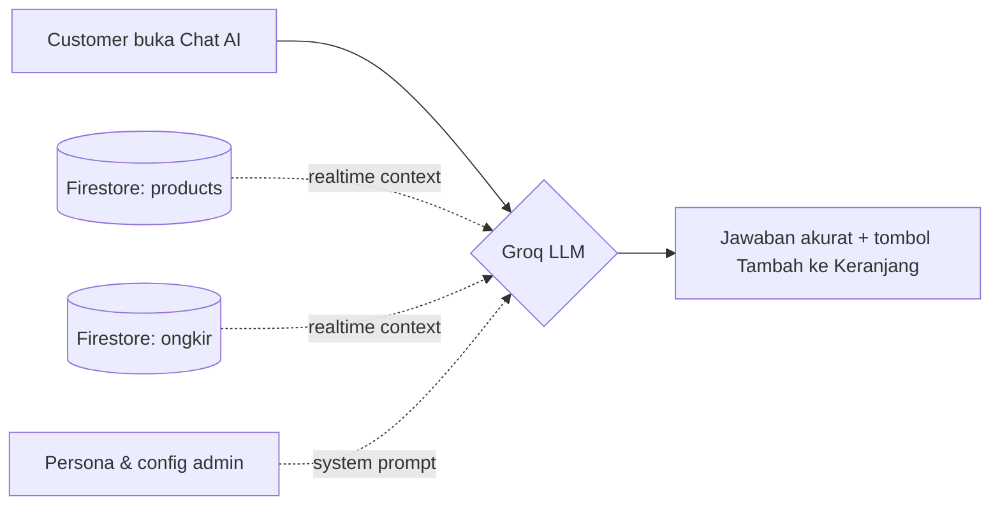

<div align="center">


<br>

<a href="https://riksan762-creator.github.io/Riksan-Dropshiper/" target="_blank">
  
</a>
<a href="https://github.com/riksan762-creator/Riksan-Dropshiper/stargazers" target="_blank">
  
</a>
<a href="https://github.com/riksan762-creator/Riksan-Dropshiper/network/members" target="_blank">
  
</a>


<br><br>


</div>

<br>

> ### ⚡ Zero backend server · Zero build step · 100% realtime
> Semua data tersinkron langsung lewat Firestore `onSnapshot`. Admin ubah harga produk dari HP, ratusan pengunjung lain langsung lihat perubahan itu **detik itu juga** — tanpa refresh, tanpa server yang perlu di-maintain.

---

## 📚 Daftar Isi

- [🤖 Fitur AI](#-ditenagai-ai--bukan-sekadar-katalog-biasa)
- [✨ Fitur Lengkap](#-fitur-lengkap)
- [🧰 Tech Stack](#-tech-stack)
- [🏗️ Arsitektur](#️-arsitektur-sistem)
- [📁 Struktur Proyek](#-struktur-proyek)
- [🚀 Cara Deploy](#-cara-deploy-sendiri)
- [🔒 Keamanan](#-keamanan-firestore-rules)
- [🗺️ Roadmap](#️-roadmap)

---

## 🤖 Ditenagai AI — Bukan Sekadar Katalog Biasa

Riksan Dropship punya **asisten belanja AI bawaan**, jalan langsung di browser customer, terhubung real-time ke **[Groq API](https://groq.com)** (`openai/gpt-oss-20b` — cepat, gratis, tanpa antre).



**Kenapa ini bukan sekadar "chatbot tempel":**

| | |
|---|---|
| 🎯 **Anti-halusinasi** | AI dilarang keras mengarang produk/harga/stok yang gak ada di database. Gak tau → jujur bilang gak tau. |
| 🛒 **Actionable** | Bisa nyaranin produk lengkap dengan tombol *"🛒 Tambah ke Keranjang"* langsung di dalam chat. |
| 💬 **Quick replies** | Rekomendasi produk, cek ongkir, cek promo — satu tap tanpa ngetik. |
| ⚙️ **No-code config** | API key, model, dan persona AI diatur penuh dari admin panel, tanpa sentuh kode. |
| 🔄 **Selalu akurat** | Stok/harga berubah di admin panel → AI langsung "tau" di chat berikutnya. Zero stale data. |

---

## ✨ Fitur Lengkap

<table>
<tr>
<td width="50%" valign="top">

### 🛍️ Storefront
- 📦 Katalog realtime, filter & sort kategori
- 🔍 Pencarian instan
- 🛒 Keranjang per-sesi (`sessionStorage`)
- 💬 Checkout otomatis → pesan WhatsApp terformat rapi
- 🚚 Estimasi ongkir dinamis per wilayah
- ⭐ Testimoni customer per produk
- 🖼️ Banner promo dengan auto-slider
- 🎁 Roda Spin Diskon (*weighted random prize*)
- 👤 Akun customer + riwayat pesanan pribadi
- 🤖 AI Shopping Assistant

</td>
<td width="50%" valign="top">

### 🔐 Admin Panel
- 🔑 Login aman via Firebase Auth + verifikasi role
- 📊 Dashboard: total produk, stok, stok kritis, terlaris
- 🧾 Riwayat pesanan masuk otomatis
- 👥 Manajemen user terdaftar
- 🏷️ CRUD produk, kategori, banner, ongkir
- ⭐ Kelola testimoni per produk
- ⚙️ Pengaturan toko: WA, Shopee, banner, AI config
- 🖼️ Upload gambar + kompresi otomatis di klien

</td>
</tr>
</table>

---

## 🧰 Tech Stack

<div align="center">


</div>

| Layer | Teknologi | Keterangan |
|---|---|---|
| **Frontend** | HTML5 · CSS3 · Vanilla JS (ES Modules) | Tanpa framework, tanpa build step |
| **Database** | Firebase Firestore | Realtime sync via `onSnapshot`, no polling |
| **Auth** | Firebase Authentication | Email/password, role admin via Firestore |
| **AI Engine** | Groq API — `openai/gpt-oss-20b` | Konfigurasi model & persona dari admin panel |
| **Hosting** | GitHub Pages | 100% statis, gratis, zero maintenance |
| **Media** | Base64 + kompresi client-side | Hemat kuota, tanpa Firebase Storage bucket |

---

## 🏗️ Arsitektur Sistem

```
┌─────────────────┐        ┌──────────────────┐        ┌─────────────────┐
│   index.html     │◄──────►│  Firebase          │◄──────►│  admin.html       │
│   (Storefront)   │  sync   │  Firestore + Auth  │  sync   │  (Admin Panel)    │
└────────┬─────────┘        └──────────────────┘        └─────────────────┘
         │                                                          
         │ chat context (produk + ongkir realtime)                 
         ▼                                                          
┌─────────────────┐                                                 
│   Groq AI API    │                                                 
│  (gpt-oss-20b)   │                                                 
└─────────────────┘
```

Tidak ada server middleware. Browser customer & browser admin **sama-sama klien langsung** ke Firebase — itu sebabnya semuanya realtime tanpa delay dan tanpa biaya server bulanan.

---

## 📁 Struktur Proyek

```
📦 Riksan-Dropshiper
├── 🏠 index.html          → Halaman toko (storefront)
├── ⚡ app.js               → Logic storefront: katalog, cart, checkout, AI chat, akun
├── 🔐 admin.html           → Panel admin
├── ⚙️ admin.js             → Logic admin: CRUD, auth, dashboard
├── 🎨 admin.css            → Styling admin panel
├── 🔑 firebase-config.js   → Konfigurasi project Firebase
└── 🛡️ firestore.rules      → Security rules Firestore
```

---

## 🚀 Cara Deploy Sendiri

```bash
1. Buat project di console.firebase.google.com
2. Aktifkan Firestore Database + Authentication (Email/Password)
3. Tempel config kamu ke firebase-config.js
4. Publish firestore.rules ke Firebase Console → Firestore → Rules
5. Buat akun admin pertama:
   → Authentication → Users → tambah user
   → Firestore → collection "admins" → Document ID = UID user tsb
6. (Opsional) Ambil API key gratis di console.groq.com/keys
   → aktifkan AI chat dari menu Pengaturan Toko
7. Push ke GitHub → Settings → Pages → aktifkan → 🎉 live
```

Seed data produk otomatis terisi begitu Firestore masih kosong saat admin panel pertama kali dibuka.

---

## 🔒 Keamanan (Firestore Rules)

| Collection | Baca | Tulis |
|---|:---:|:---:|
| `products` `banners` `settings` `ongkir` `testimoni` | 🌍 Publik | 🔐 Admin saja |
| `orders` | 🔐 Admin / pemilik pesanan | ✍️ Create publik, edit admin saja |
| `customers` | 🔐 Admin / pemilik akun | 🔐 Pemilik akun saja |
| `admins` | 🔐 Hanya baca dokumen milik sendiri | 🚫 Tidak bisa ditulis dari client |

> ⚠️ Groq API key dipanggil langsung dari browser (arsitektur tanpa backend) — pantau usage secara berkala dan rotate key jika dicurigai disalahgunakan.

---

## 🗺️ Roadmap

- [x] Katalog & keranjang realtime
- [x] Checkout via WhatsApp otomatis
- [x] AI Shopping Assistant
- [x] Akun customer & riwayat pesanan
- [x] Roda Spin diskon
- [ ] Notifikasi push untuk pesanan baru
- [ ] Integrasi payment gateway langsung
- [ ] Mode multi-toko (multi-tenant)

---

<div align="center">

<br>

**⭐ Kalau proyek ini membantu, jangan lupa kasih star di repo-nya!**


<br><br>


</div>
