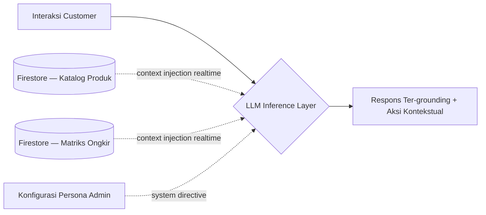

<div align="center">


<br>

<a href="https://riksan762-creator.github.io/Riksan-Dropshiper/" target="_blank">
  
</a>
<a href="https://github.com/riksan762-creator/Riksan-Dropshiper/stargazers" target="_blank">
  
</a>
<a href="https://github.com/riksan762-creator/Riksan-Dropshiper/network/members" target="_blank">
  
</a>


<br><br>


</div>

<br>

<div align="center">

*"Kompleksitas terbaik adalah kompleksitas yang tidak terlihat oleh pengguna, namun sepenuhnya terkendali oleh pengembangnya."*

</div>

<br>

> ### ⚡ Filosofi Rancangan
> Proyek ini dibangun di atas premis bahwa **kesederhanaan arsitektur bukan kompromi, melainkan keunggulan kompetitif**. Tanpa server aplikasi, tanpa build pipeline, tanpa lapisan abstraksi yang tidak perlu — hanya klien statis yang berbicara langsung dengan lapisan data terkelola (*managed backend*). Setiap keputusan teknis diarahkan pada satu tujuan: **konsistensi data realtime dengan biaya operasional dan kognitif seminimal mungkin.**

---

## 📚 Daftar Isi

- [🧠 Lapisan Kecerdasan Buatan](#-lapisan-kecerdasan-buatan)
- [✨ Kapabilitas Sistem](#-kapabilitas-sistem)
- [🧰 Susunan Teknologi](#-susunan-teknologi)
- [🏗️ Rancangan Arsitektur](#️-rancangan-arsitektur)
- [📁 Anatomi Proyek](#-anatomi-proyek)
- [🚀 Provisioning & Deployment](#-provisioning--deployment)
- [🔒 Model Keamanan](#-model-keamanan)
- [📈 Pertimbangan Rekayasa](#-pertimbangan-rekayasa)
- [🗺️ Roadmap](#️-roadmap)

---

## 🧠 Lapisan Kecerdasan Buatan

Riksan Dropship mengintegrasikan **agen percakapan berbasis LLM** (via [Groq](https://groq.com), model `openai/gpt-oss-20b`) yang tidak beroperasi dalam ruang hampa — melainkan **di-*ground*-kan langsung pada state database realtime**, bukan pengetahuan statis yang bisa kedaluwarsa.



**Prinsip rancangan agen ini:**

| Prinsip | Implementasi |
|---|---|
| 🎯 **Grounding, bukan generasi bebas** | Model diinstruksikan eksplisit untuk menolak berspekulasi di luar data katalog yang tersedia — mengeliminasi risiko halusinasi produk atau harga fiktif. |
| 🛒 **Dari dialog ke aksi** | Rekomendasi produk dirender sebagai elemen interaktif (tombol tambah keranjang), bukan sekadar teks — menjembatani percakapan dengan transaksi. |
| ⚙️ **Konfigurasi deklaratif** | Model, kunci API, dan persona diatur sepenuhnya melalui panel admin — tanpa redeploy kode. |
| 🔄 **Konsistensi temporal** | Karena context window dibangun dari query realtime, tidak ada jeda antara perubahan data dan pengetahuan yang dimiliki agen. |

---

## ✨ Kapabilitas Sistem

<table>
<tr>
<td width="50%" valign="top">

### 🛍️ Antarmuka Publik (Storefront)
- Katalog dengan sinkronisasi realtime lintas sesi
- Mesin pencarian & penyortiran multi-kriteria
- Manajemen keranjang berbasis sesi (`sessionStorage`)
- Alur checkout terkonversi otomatis ke WhatsApp
- Kalkulasi estimasi ongkir berbasis wilayah
- Sistem testimoni terkait produk
- Karusel promosi dengan rotasi otomatis
- Mekanisme gamifikasi (*weighted randomization*)
- Manajemen identitas customer & riwayat transaksi
- Agen percakapan berbasis AI

</td>
<td width="50%" valign="top">

### 🔐 Antarmuka Administratif
- Autentikasi dengan verifikasi peran berlapis
- Dasbor analitik: inventori, stok kritis, performa produk
- Pencatatan transaksi masuk secara otomatis
- Manajemen basis pengguna terdaftar
- Operasi CRUD penuh: produk, kategori, banner, ongkir
- Kurasi testimoni per entitas produk
- Konfigurasi parameter toko & agen AI
- Kompresi aset visual di sisi klien

</td>
</tr>
</table>

---

## 🧰 Susunan Teknologi

<div align="center">


</div>

| Lapisan | Teknologi | Rasionalisasi Teknis |
|---|---|---|
| **Presentasi** | HTML5 · CSS3 (design token system) · Vanilla JavaScript (ES Modules) | Menghindari overhead framework untuk aplikasi dengan kompleksitas state yang moderat |
| **Persistensi Data** | Firebase Firestore | Model data dokumen dengan sinkronisasi push-based (`onSnapshot`), mengeliminasi kebutuhan polling |
| **Identitas & Akses** | Firebase Authentication | Autentikasi terkelola dengan verifikasi peran melalui security rules deklaratif |
| **Inferensi AI** | Groq API (`openai/gpt-oss-20b`) | Latensi inferensi rendah, cocok untuk interaksi percakapan sinkron |
| **Distribusi** | GitHub Pages | CDN statis global tanpa biaya infrastruktur berkelanjutan |
| **Manajemen Aset** | Encoding Base64 + kompresi client-side | Menghindari kompleksitas operasional object storage terpisah |

---

## 🏗️ Rancangan Arsitektur

```
┌───────────────────┐        ┌─────────────────────┐        ┌───────────────────┐
│    Storefront       │◄──────►│   Firebase Platform   │◄──────►│    Admin Console     │
│  (index.html/app.js)│  sync   │  Firestore + Auth     │  sync   │ (admin.html/admin.js)│
└──────────┬──────────┘        └─────────────────────┘        └───────────────────┘
           │
           │  context injection (produk & ongkir, realtime)
           ▼
┌───────────────────┐
│   Groq Inference     │
│   (gpt-oss-20b)      │
└───────────────────┘
```

Tidak terdapat lapisan middleware atau server aplikasi. Baik klien publik maupun administratif berkomunikasi **langsung** dengan platform Firebase sebagai *single source of truth* — pola yang meminimalkan titik kegagalan sekaligus menghilangkan biaya pemeliharaan server konvensional.

---

## 📁 Anatomi Proyek

```
📦 Riksan-Dropshiper
├── 🏠 index.html          → Titik masuk antarmuka publik
├── ⚡ app.js               → Logika storefront: katalog, transaksi, agen AI, identitas
├── 🔐 admin.html           → Titik masuk konsol administratif
├── ⚙️ admin.js             → Logika admin: operasi data, autentikasi, analitik
├── 🎨 admin.css            → Sistem desain antarmuka admin
├── 🔑 firebase-config.js   → Kredensial & inisialisasi platform
└── 🛡️ firestore.rules      → Definisi kebijakan akses data
```

---

## 🚀 Provisioning & Deployment

```bash
1. Inisialisasi proyek di console.firebase.google.com
2. Aktifkan Firestore Database & Authentication (Email/Password)
3. Salin kredensial ke firebase-config.js
4. Terapkan firestore.rules melalui Firebase Console → Firestore → Rules
5. Provisioning identitas administratif pertama:
   → Authentication → Users → registrasi akun
   → Firestore → koleksi "admins" → Document ID = UID akun tersebut
6. (Opsional) Peroleh kunci API di console.groq.com/keys
   → aktifkan agen AI melalui panel Pengaturan Toko
7. Push ke repositori GitHub → Settings → Pages → aktifkan
```

Data awal (*seed data*) terpopulasi otomatis pada inisialisasi pertama ketika koleksi Firestore masih kosong — meniadakan kebutuhan entri data manual di tahap awal.

---

## 🔒 Model Keamanan

Kebijakan akses data dirancang mengikuti **prinsip privilese minimum** (*principle of least privilege*), didefinisikan secara deklaratif melalui Firestore Security Rules — bukan divalidasi di sisi klien yang inheren dapat dimanipulasi.

| Koleksi Data | Hak Baca | Hak Tulis |
|---|:---:|:---:|
| `products` `banners` `settings` `ongkir` `testimoni` | 🌍 Publik | 🔐 Peran admin |
| `orders` | 🔐 Admin / pemilik transaksi | ✍️ Penciptaan terbuka, modifikasi admin |
| `customers` | 🔐 Admin / pemilik identitas | 🔐 Eksklusif pemilik identitas |
| `admins` | 🔐 Eksklusif dokumen kepemilikan sendiri | 🚫 Tidak dapat ditulis dari klien |

> ⚠️ **Catatan transparansi:** Kunci API Groq dipanggil langsung dari konteks klien (konsekuensi arsitektur tanpa backend intermediary). Praktik terbaik yang direkomendasikan: audit penggunaan berkala dan rotasi kunci bila teridentifikasi anomali.

---

## 📈 Pertimbangan Rekayasa

- **Konsistensi eventual vs. strong consistency** — Firestore `onSnapshot` memberikan propagasi perubahan dalam hitungan milidetik, cukup untuk kasus penggunaan e-commerce skala kecil-menengah tanpa kompleksitas distributed consensus.
- **Trade-off keamanan kunci API sisi klien** — diterima secara sadar sebagai konsekuensi arsitektur serverless murni; dimitigasi lewat monitoring dan rotasi berkala, bukan dihindari lewat penambahan backend proxy yang mengorbankan kesederhanaan sistem.
- **Skalabilitas horizontal implisit** — karena tidak ada server aplikasi yang di-*provision* manual, kapasitas mengikuti kuota dan SLA platform Firebase/GitHub Pages secara otomatis.

---

## 🗺️ Roadmap

- [x] Katalog & transaksi realtime
- [x] Konversi checkout otomatis ke WhatsApp
- [x] Agen percakapan berbasis AI dengan grounding data
- [x] Manajemen identitas & riwayat transaksi customer
- [x] Mekanisme gamifikasi diskon
- [ ] Notifikasi push untuk transaksi masuk
- [ ] Integrasi payment gateway native
- [ ] Arsitektur multi-tenant

---

<div align="center">

<br>

**Jika arsitektur atau pendekatan rekayasa proyek ini memberi nilai bagi Anda, pertimbangkan untuk memberi ⭐ pada repositori ini.**


<br><br>


</div>
