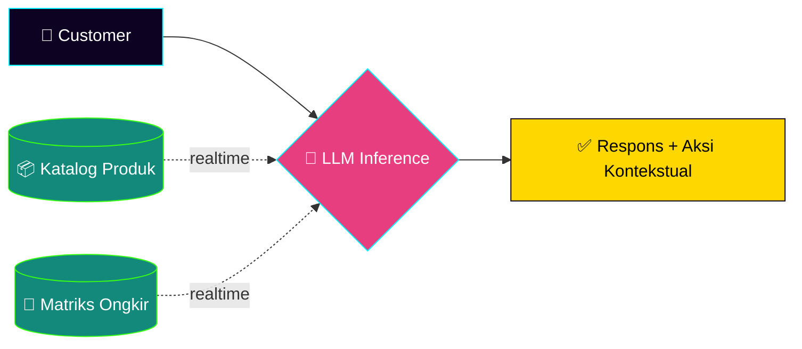
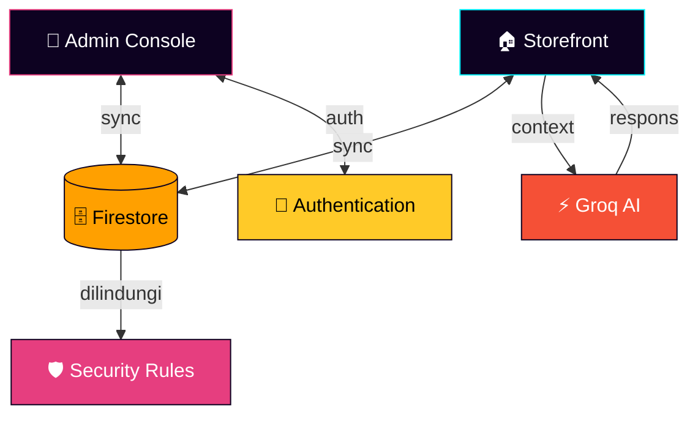

<div align="center">


<br>

[](https://riksan762-creator.github.io/Riksan-Dropshiper/)
[](https://github.com/riksan762-creator/Riksan-Dropshiper/stargazers)
[](https://github.com/riksan762-creator/Riksan-Dropshiper/network/members)
[](#)

<br>


</div>

<br>

> ### ⚡ Filosofi Rancangan
> Proyek ini dibangun di atas premis bahwa **kesederhanaan arsitektur bukan kompromi, melainkan keunggulan kompetitif**. Tanpa server aplikasi, tanpa build pipeline — hanya klien statis yang berbicara langsung dengan lapisan data terkelola. **Konsistensi data realtime dengan biaya operasional seminimal mungkin.**

---

## 📚 Daftar Isi

- [🧠 Lapisan Kecerdasan Buatan](#-lapisan-kecerdasan-buatan)
- [✨ Kapabilitas Sistem](#-kapabilitas-sistem)
- [🧰 Susunan Teknologi](#-susunan-teknologi)
- [🏗️ Rancangan Arsitektur](#️-rancangan-arsitektur)
- [📁 Anatomi Proyek](#-anatomi-proyek)
- [🚀 Provisioning & Deployment](#-provisioning--deployment)
- [🔒 Model Keamanan](#-model-keamanan)
- [🗺️ Roadmap](#️-roadmap)

---

## 🧠 Lapisan Kecerdasan Buatan

Riksan Dropship mengintegrasikan **agen percakapan berbasis LLM** (via [Groq](https://groq.com), model `openai/gpt-oss-20b`) yang **di-*ground*-kan langsung pada state database realtime** — bukan pengetahuan statis yang bisa kedaluwarsa.


```mermaid
graph LR
    A[💬 Customer] --> B{🧠 LLM Inference}
    C[(📦 Katalog Produk)] -.realtime.-> B
    D[(🚚 Matriks Ongkir)] -.realtime.-> B
    B --> F[✅ Respons + Aksi Kontekstual]

    style A fill:#0D0221,stroke:#00F5FF,color:#fff
    style B fill:#E63E7F,stroke:#00F5FF,color:#fff
    style C fill:#12897A,stroke:#39FF14,color:#fff
    style D fill:#12897A,stroke:#39FF14,color:#fff
    style F fill:#FFD700,stroke:#0D0221,color:#000
```

| Prinsip | Implementasi |
|---|---|
| 🎯 **Grounding, bukan generasi bebas** | Model dilarang berspekulasi di luar data katalog — no halusinasi produk/harga. |
| 🛒 **Dari dialog ke aksi** | Rekomendasi produk dirender sebagai tombol interaktif tambah keranjang. |
| ⚙️ **Konfigurasi deklaratif** | Model, API key, dan persona diatur lewat panel admin — tanpa redeploy. |

---

## ✨ Kapabilitas Sistem

<table>
<tr>
<td width="50%" valign="top">

### 🛍️ Storefront
- 🔄 Katalog realtime lintas sesi
- 🔍 Pencarian & filter multi-kriteria
- 🛒 Keranjang berbasis `sessionStorage`
- 📲 Checkout otomatis ke WhatsApp
- 📦 Estimasi ongkir per wilayah
- ⭐ Testimoni produk
- 🎰 Gamifikasi diskon
- 🤖 Agen belanja berbasis AI

</td>
<td width="50%" valign="top">

### 🔐 Admin Console
- 🔑 Autentikasi berlapis
- 📊 Dasbor analitik & stok kritis
- 🧾 Pencatatan transaksi otomatis
- 👥 Manajemen pengguna
- 🛠️ CRUD produk, kategori, banner, ongkir
- ⚙️ Konfigurasi toko & agen AI

</td>
</tr>
</table>

---

## 🧰 Susunan Teknologi

| Lapisan | Teknologi | Alasan |
|---|---|---|
| 🎨 Presentasi | HTML5 · CSS3 · Vanilla JavaScript | Ringan, tanpa overhead framework |
| 💾 Data | Firebase Firestore | Sinkronisasi push-based (`onSnapshot`) |
| 🔑 Auth | Firebase Authentication | Verifikasi peran via security rules |
| 🧠 AI | Groq API (`gpt-oss-20b`) | Latensi rendah untuk chat sinkron |
| 🌐 Hosting | GitHub Pages | CDN statis global, gratis |

---

## 🏗️ Rancangan Arsitektur


```mermaid
graph TB
    A[🏠 Storefront] <--sync--> C[(🗄️ Firestore)]
    B[🔐 Admin Console] <--sync--> C
    B <--auth--> D[🔑 Authentication]
    C --dilindungi--> E[🛡️ Security Rules]
    A --context--> F[⚡ Groq AI]
    F --respons--> A

    style A fill:#0D0221,stroke:#00F5FF,color:#fff
    style B fill:#0D0221,stroke:#E63E7F,color:#fff
    style C fill:#FFA000,stroke:#0D0221,color:#000
    style D fill:#FFCA28,stroke:#0D0221,color:#000
    style E fill:#E63E7F,stroke:#0D0221,color:#fff
    style F fill:#F55036,stroke:#0D0221,color:#fff
```

Tidak ada server aplikasi di tengah. Klien publik & admin berbicara **langsung** ke Firebase sebagai *single source of truth*.

---

## 📁 Anatomi Proyek

```
📦 Riksan-Dropshiper
├── 🏠 index.html            → Antarmuka publik
├── ⚡ app.js                 → Logika storefront + AI
├── 🔐 admin.html             → Antarmuka admin
├── ⚙️  admin.js               → Logika admin
├── 🎨 admin.css              → Desain admin
├── 🔑 firebase-config.js     → Kredensial Firebase
└── 🛡️  firestore.rules        → Kebijakan akses data
```

---

## 🚀 Provisioning & Deployment

```bash
1. Buat proyek di console.firebase.google.com
2. Aktifkan Firestore + Authentication (Email/Password)
3. Salin kredensial ke firebase-config.js
4. Terapkan firestore.rules lewat Firebase Console
5. Buat akun admin pertama → tambahkan UID ke koleksi "admins"
6. (Opsional) Ambil API key di console.groq.com/keys → isi di panel admin
7. Push ke GitHub → Settings → Pages → aktifkan
```

> 💡 Seed data terisi otomatis saat Firestore masih kosong — tidak perlu entry manual.

---

## 🔒 Model Keamanan

Kebijakan akses mengikuti **prinsip privilese minimum**, didefinisikan lewat Firestore Security Rules — bukan validasi sisi klien yang bisa dimanipulasi.

| Koleksi | Baca | Tulis |
|---|:---:|:---:|
| `products` `banners` `settings` `ongkir` | 🌍 Publik | 🔐 Admin |
| `orders` | 🔐 Admin/pemilik | ✍️ Buat terbuka, ubah admin |
| `customers` | 🔐 Pemilik | 🔐 Pemilik |
| `admins` | 🔐 Diri sendiri | 🚫 Tidak bisa dari klien |

> ⚠️ API key Groq dipanggil dari sisi klien — konsekuensi arsitektur tanpa backend. Mitigasi: audit & rotasi kunci berkala.

---

## 🗺️ Roadmap

- [x] Katalog & transaksi realtime
- [x] Checkout otomatis ke WhatsApp
- [x] Agen AI dengan grounding data
- [x] Gamifikasi diskon
- [ ] Notifikasi push transaksi
- [ ] Payment gateway native
- [ ] Arsitektur multi-tenant

---

<div align="center">


</div>
