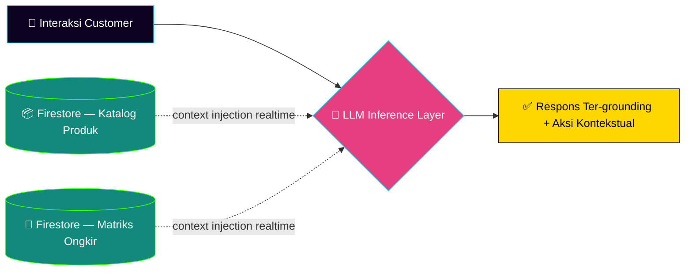
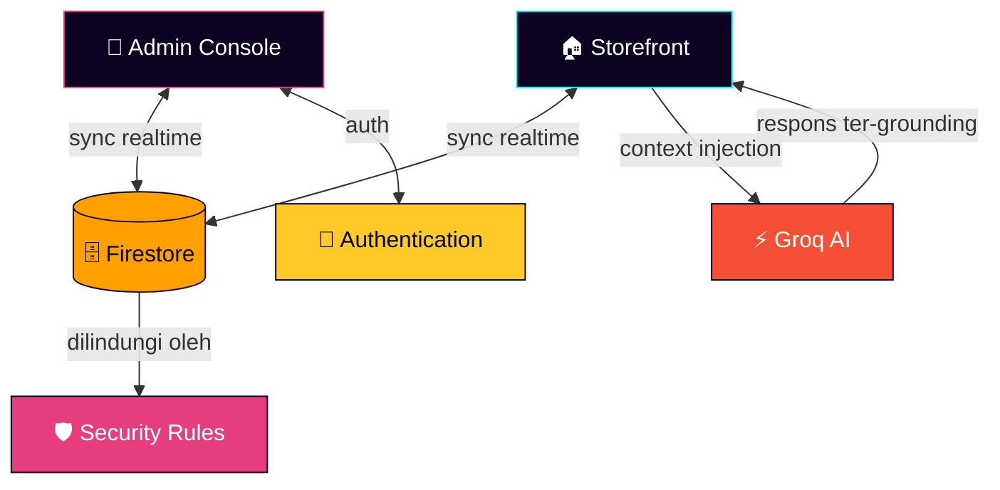

<div align="center">

<div align="center">

⋆｡‍𖦹°‧⚡‧°𖦹‍｡⋆

</div>


<div align="center">

▁ ▂ ▃ ▄ ▅ ▆ ▇ █ ✦ █ ▇ ▆ ▅ ▄ ▃ ▂ ▁

</div>


<sub>✦ &nbsp;full-stack builder&nbsp; ⟡ &nbsp;serverless architecture&nbsp; ⟡ &nbsp;AI-augmented engineering&nbsp; ✦</sub>

<br>

[](https://riksan762-creator.github.io/Riksan-Dropshiper/)
[](https://github.com/riksan762-creator/Riksan-Dropshiper/stargazers)
[](#-lisensi)

<br>


</div>

<br>

> ### ⚡ Filosofi Rancangan
> Perangkat lunak yang baik bukan diukur dari seberapa banyak lapisan teknologi yang ia bawa, melainkan dari seberapa sedikit hal yang bisa berjalan salah. Proyek ini lahir dari keyakinan bahwa **kesederhanaan arsitektural adalah bentuk kedewasaan rekayasa**, bukan keterbatasan. Tidak ada server aplikasi yang perlu dijaga hidupnya di tengah malam, tidak ada pipeline build yang bisa gagal secara diam-diam — hanya klien statis yang bercakap langsung dengan lapisan data terkelola, dan sebuah agen kecerdasan buatan yang selalu berpijak pada kebenaran data yang sama dengan yang dilihat penggunanya.

---

## 📚 Daftar Isi

| | |
|---|---|
| [🔎 Ringkasan](#-ringkasan) | [🏗️ Arsitektur](#️-rancangan-arsitektur) |
| [🧠 Lapisan AI](#-lapisan-kecerdasan-buatan) | [📁 Struktur Proyek](#-anatomi-proyek) |
| [✨ Fitur](#-kapabilitas-sistem) | [🚀 Instalasi](#-provisioning--deployment) |
| [🧰 Tech Stack](#-susunan-teknologi) | [🔒 Keamanan](#-model-keamanan) |
| [📈 Catatan Rekayasa](#-pertimbangan-rekayasa) | [🗺️ Roadmap](#️-roadmap) |

---

## 🔎 Ringkasan

Riksan Dropship adalah eksplorasi terhadap satu pertanyaan sederhana: **seberapa jauh sebuah aplikasi komersial dapat dibangun tanpa mengorbankan keandalan, hanya dengan menghilangkan setiap lapisan yang tidak benar-benar diperlukan?** Jawabannya adalah sebuah platform dropshipping yang sepenuhnya *serverless* — storefront publik, panel administratif, dan asisten belanja berbasis kecerdasan buatan, semuanya berjalan di atas fondasi HTML, CSS, dan JavaScript murni yang berbicara langsung dengan Firebase sebagai *backend-as-a-service*.

Pendekatan ini bukan sekadar pilihan teknis, melainkan sikap rekayasa. Setiap baris kode yang tidak ditulis adalah baris kode yang tidak akan pernah menjadi bug. Setiap dependensi yang tidak ditambahkan adalah satu kerentanan keamanan yang tidak perlu dipantau. Filosofi minimalis ini diterapkan secara konsisten, dari lapisan presentasi hingga model keamanan data.

| Aspek | Detail |
|---|---|
| 🎯 Target pengguna | Pelaku dropship & UMKM digital Indonesia |
| ⚙️ Model arsitektur | Serverless, client-direct-to-database |
| 🧠 Fitur unggulan | Asisten belanja AI dengan grounding data realtime |
| 💸 Biaya infrastruktur | Free tier Firebase + GitHub Pages |

---

## 🧠 Lapisan Kecerdasan Buatan

Kebanyakan implementasi chatbot AI dalam e-commerce mengandalkan pengetahuan statis yang dibekukan pada saat pelatihan model — sebuah pendekatan yang secara struktural rentan terhadap halusinasi: model dapat dengan percaya diri menyebutkan produk yang sudah tidak tersedia, atau harga yang telah berubah berminggu-minggu lalu. Riksan Dropship mengambil pendekatan berbeda.

Agen percakapan di sini (didukung [Groq](https://groq.com) dengan model `openai/gpt-oss-20b`, dipilih karena latensi inferensinya yang sangat rendah dan cocok untuk interaksi sinkron) **tidak pernah berbicara dari memori, melainkan dari kenyataan** — setiap respons dibangun dari *context injection* yang diambil langsung dari state Firestore terkini pada saat percakapan berlangsung. Ini berarti tidak ada jeda temporal antara perubahan data dan pengetahuan yang dimiliki agen; ketika seorang admin mengubah harga produk, detik berikutnya agen AI sudah "mengetahui" perubahan tersebut tanpa perlu retraining atau redeploy.


```mermaid
graph LR
    A[💬 Interaksi Customer] --> B{🧠 LLM Inference Layer}
    C[(📦 Firestore — Katalog Produk)] -.context injection realtime.-> B
    D[(🚚 Firestore — Matriks Ongkir)] -.context injection realtime.-> B
    B --> F[✅ Respons Ter-grounding + Aksi Kontekstual]

    style A fill:#0D0221,stroke:#00F5FF,color:#fff
    style B fill:#E63E7F,stroke:#00F5FF,color:#fff
    style C fill:#12897A,stroke:#39FF14,color:#fff
    style D fill:#12897A,stroke:#39FF14,color:#fff
    style F fill:#FFD700,stroke:#0D0221,color:#000
```

| Prinsip | Implementasi |
|---|---|
| 🎯 **Grounding di atas generasi bebas** | Model diinstruksikan secara eksplisit untuk menolak berspekulasi di luar data katalog yang tersedia — mengeliminasi risiko halusinasi produk maupun harga fiktif secara struktural, bukan sekadar melalui prompt engineering permukaan. |
| 🛒 **Dari dialog menuju aksi nyata** | Rekomendasi yang dihasilkan agen tidak berhenti sebagai teks pasif, melainkan dirender sebagai elemen antarmuka interaktif — menjembatani kesenjangan antara percakapan dan transaksi yang biasanya membutuhkan langkah manual tambahan. |
| ⚙️ **Konfigurasi deklaratif, bukan hardcoded** | Pemilihan model, kredensial API, dan persona percakapan seluruhnya diatur melalui panel admin, memungkinkan iterasi cepat tanpa menyentuh basis kode maupun melakukan redeploy. |

---

## ✨ Kapabilitas Sistem

<table>
<tr>
<td width="50%" valign="top">

### 🛍️ Storefront

| Fitur | Status |
|---|:---:|
| Katalog realtime lintas sesi | ✅ |
| Pencarian & filter multi-kriteria | ✅ |
| Keranjang berbasis `sessionStorage` | ✅ |
| Checkout otomatis ke WhatsApp | ✅ |
| Estimasi ongkir per wilayah | ✅ |
| Testimoni produk | ✅ |
| Gamifikasi diskon | ✅ |
| Asisten belanja AI | ✅ |

</td>
<td width="50%" valign="top">

### 🔐 Admin Console

| Fitur | Status |
|---|:---:|
| Autentikasi berlapis | ✅ |
| Dasbor analitik & stok kritis | ✅ |
| Pencatatan transaksi otomatis | ✅ |
| Manajemen pengguna terdaftar | ✅ |
| CRUD produk/kategori/banner/ongkir | ✅ |
| Kurasi testimoni | ✅ |
| Konfigurasi toko & agen AI | ✅ |

</td>
</tr>
</table>

---

## 🧰 Susunan Teknologi

Setiap teknologi dalam susunan ini dipilih bukan karena tren, melainkan karena kesesuaiannya dengan skala dan karakter masalah yang dihadapi. Framework frontend modern secara sengaja dihindari — bukan karena penolakan terhadap kompleksitas mereka menawarkan, melainkan karena kompleksitas itu tidak dibutuhkan pada skala aplikasi ini.

| Lapisan | Teknologi | Rasionalisasi Teknis |
|---|---|---|
| 🎨 **Presentasi** | HTML5 · CSS3 · Vanilla JavaScript (ES Modules) | Menghindari overhead framework untuk aplikasi dengan kompleksitas state yang moderat |
| 💾 **Persistensi Data** | Firebase Firestore | Model data dokumen dengan sinkronisasi push-based (`onSnapshot`), mengeliminasi kebutuhan polling |
| 🔑 **Identitas & Akses** | Firebase Authentication | Autentikasi terkelola dengan verifikasi peran melalui security rules deklaratif |
| 🧠 **Inferensi AI** | Groq API (`openai/gpt-oss-20b`) | Latensi inferensi rendah, cocok untuk interaksi percakapan sinkron |
| 🌐 **Distribusi** | GitHub Pages | CDN statis global tanpa biaya infrastruktur berkelanjutan |

---

## 🏗️ Rancangan Arsitektur


```mermaid
graph TB
    A[🏠 Storefront] <--sync realtime--> C[(🗄️ Firestore)]
    B[🔐 Admin Console] <--sync realtime--> C
    B <--auth--> D[🔑 Authentication]
    C --dilindungi oleh--> E[🛡️ Security Rules]
    A --context injection--> F[⚡ Groq AI]
    F --respons ter-grounding--> A

    style A fill:#0D0221,stroke:#00F5FF,color:#fff
    style B fill:#0D0221,stroke:#E63E7F,color:#fff
    style C fill:#FFA000,stroke:#0D0221,color:#000
    style D fill:#FFCA28,stroke:#0D0221,color:#000
    style E fill:#E63E7F,stroke:#0D0221,color:#fff
    style F fill:#F55036,stroke:#0D0221,color:#fff
```

Tidak terdapat lapisan middleware maupun server aplikasi di antara klien dan data. Baik antarmuka publik maupun administratif berkomunikasi **langsung** dengan Firebase sebagai *single source of truth* — sebuah pola yang secara sengaja meminimalkan permukaan kegagalan (*failure surface*) sekaligus menghapus biaya operasional pemeliharaan server konvensional.

---

## 📁 Anatomi Proyek

```
📦 Riksan-Dropshiper
├── 🏠 index.html            → Titik masuk antarmuka publik
├── ⚡ app.js                 → Logika storefront, transaksi, dan agen AI
├── 🔐 admin.html             → Titik masuk konsol administratif
├── ⚙️  admin.js               → Logika operasional admin
├── 🎨 admin.css              → Sistem desain antarmuka admin
├── 🔑 firebase-config.js     → Kredensial & inisialisasi platform
└── 🛡️  firestore.rules        → Definisi kebijakan akses data
```

---

## 🚀 Provisioning & Deployment

```bash
1. Buat proyek di console.firebase.google.com
2. Aktifkan Firestore Database & Authentication (Email/Password)
3. Salin kredensial ke firebase-config.js
4. Terapkan firestore.rules melalui Firebase Console → Firestore → Rules
5. Registrasikan akun admin pertama → tambahkan UID ke koleksi "admins"
6. (Opsional) Peroleh kunci API di console.groq.com/keys → aktifkan di panel admin
7. Push ke repositori GitHub → Settings → Pages → aktifkan
```

> 💡 Data awal (*seed data*) terpopulasi otomatis pada inisialisasi pertama, ketika koleksi Firestore masih kosong — meniadakan kebutuhan entri data manual di tahap awal.

---

## 🔒 Model Keamanan

Keamanan pada arsitektur *serverless* tidak dapat mengandalkan validasi sisi klien, karena klien pada dasarnya adalah lingkungan yang tidak dapat dipercaya sepenuhnya — kode apapun yang berjalan di peramban pengguna berpotensi dimodifikasi. Oleh karena itu, seluruh kebijakan akses data pada proyek ini didefinisikan secara deklaratif melalui Firestore Security Rules, mengikuti **prinsip privilese minimum** (*principle of least privilege*): setiap entitas hanya diberi akses yang secara ketat diperlukan untuk menjalankan fungsinya, tidak lebih.

| Koleksi Data | Hak Baca | Hak Tulis |
|---|:---:|:---:|
| `products` `banners` `settings` `ongkir` `testimoni` | 🌍 Publik | 🔐 Peran admin |
| `orders` | 🔐 Admin / pemilik transaksi | ✍️ Penciptaan terbuka, modifikasi admin |
| `customers` | 🔐 Admin / pemilik identitas | 🔐 Eksklusif pemilik identitas |
| `admins` | 🔐 Eksklusif dokumen kepemilikan sendiri | 🚫 Tidak dapat ditulis dari klien |

> ⚠️ **Catatan transparansi:** Kunci API Groq dipanggil langsung dari konteks klien — sebuah konsekuensi tak terhindarkan dari arsitektur tanpa backend intermediary. Risiko ini diterima secara sadar dan dimitigasi melalui audit penggunaan berkala serta rotasi kunci ketika teridentifikasi anomali, bukan dihindari dengan menambahkan lapisan proxy yang akan mengorbankan kesederhanaan sistem secara keseluruhan.

---

## 📈 Pertimbangan Rekayasa

- **Konsistensi eventual versus strong consistency** — Firestore `onSnapshot` memberikan propagasi perubahan dalam hitungan milidetik, cukup memadai untuk kasus penggunaan e-commerce skala kecil-menengah tanpa perlu menanggung kompleksitas *distributed consensus*.
- **Trade-off keamanan kunci API sisi klien** — diterima secara sadar sebagai konsekuensi arsitektur serverless murni, dimitigasi lewat pemantauan dan rotasi berkala, bukan dihindari lewat penambahan backend proxy yang akan mengorbankan kesederhanaan sistem.
- **Skalabilitas horizontal implisit** — karena tidak ada server aplikasi yang perlu di-*provision* secara manual, kapasitas sistem mengikuti kuota dan SLA platform Firebase serta GitHub Pages secara otomatis, tanpa intervensi operasional.

---

## 🗺️ Roadmap

- [x] Katalog & transaksi realtime
- [x] Konversi checkout otomatis ke WhatsApp
- [x] Agen percakapan berbasis AI dengan grounding data
- [x] Mekanisme gamifikasi diskon
- [ ] Notifikasi push untuk transaksi masuk
- [ ] Integrasi payment gateway native
- [ ] Arsitektur multi-tenant

---

## 📄 Lisensi

Proyek ini dirilis di bawah lisensi **MIT** — bebas digunakan, dimodifikasi, dan didistribusikan dengan atribusi yang layak kepada pengembang asal.

---

<div align="center">


</div>
