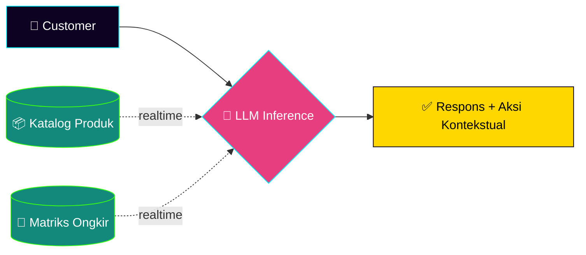
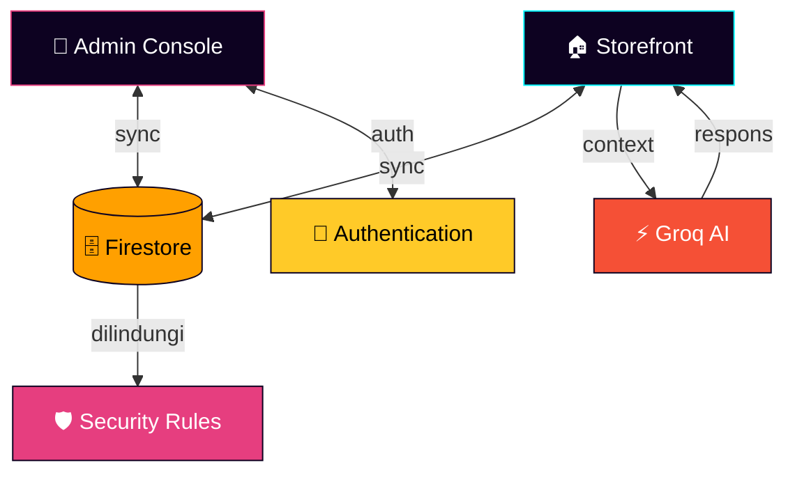

<div align="center">


<br>

[](https://riksan762-creator.github.io/Riksan-Dropshiper/)
[](https://github.com/riksan762-creator/Riksan-Dropshiper/stargazers)
[](https://github.com/riksan762-creator/Riksan-Dropshiper/network/members)
[](#-lisensi)

<br>


</div>

<br>

<div align="center">

### 🧩 Dibangun dengan


### 🧠 Didukung AI


</div>

<br>

> ### ⚡ Filosofi Rancangan
> Proyek ini dibangun di atas premis bahwa **kesederhanaan arsitektur bukan kompromi, melainkan keunggulan kompetitif**. Tanpa server aplikasi, tanpa build pipeline — hanya klien statis yang berbicara langsung dengan lapisan data terkelola. **Konsistensi data realtime dengan biaya operasional seminimal mungkin.**

---

## 📚 Daftar Isi

| | |
|---|---|
| [🔎 Ringkasan](#-ringkasan) | [🏗️ Arsitektur](#️-rancangan-arsitektur) |
| [🧠 Lapisan AI](#-lapisan-kecerdasan-buatan) | [📁 Struktur Proyek](#-anatomi-proyek) |
| [✨ Fitur](#-kapabilitas-sistem) | [🚀 Instalasi](#-provisioning--deployment) |
| [🧰 Tech Stack](#-susunan-teknologi) | [🔒 Keamanan](#-model-keamanan) |
| [🗺️ Roadmap](#️-roadmap) | [📄 Lisensi](#-lisensi) |

---

## 🔎 Ringkasan

**Riksan Dropship** adalah platform e-commerce dropshipping *serverless* untuk pasar Indonesia — menggabungkan storefront publik, panel admin, dan asisten belanja bertenaga AI dalam satu arsitektur tanpa server aplikasi. Dibangun murni dengan HTML/CSS/JS dan Firebase sebagai *backend-as-a-service*, lalu didistribusikan gratis lewat GitHub Pages.

| Aspek | Detail |
|---|---|
| 🎯 Target pengguna | Pelaku dropship & UMKM Indonesia |
| ⚙️ Model arsitektur | Serverless, client-direct-to-database |
| 🧠 Fitur unggulan | Asisten belanja AI dengan grounding data realtime |
| 💸 Biaya infrastruktur | Free tier Firebase + GitHub Pages |

---

## 🧠 Lapisan Kecerdasan Buatan

Riksan Dropship mengintegrasikan **agen percakapan berbasis LLM** (via [Groq](https://groq.com), model `openai/gpt-oss-20b`) yang **di-*ground*-kan langsung pada state database realtime** — bukan pengetahuan statis yang bisa kedaluwarsa.


```mermaid
graph LR
    A[💬 Customer] --> B{🧠 LLM Inference}
    C[(📦 Katalog Produk)] -.realtime.-> B
    D[(🚚 Matriks Ongkir)] -.realtime.-> B
    B --> F[✅ Respons + Aksi Kontekstual]

    style A fill:#0D0221,stroke:#00F5FF,color:#fff
    style B fill:#E63E7F,stroke:#00F5FF,color:#fff
    style C fill:#12897A,stroke:#39FF14,color:#fff
    style D fill:#12897A,stroke:#39FF14,color:#fff
    style F fill:#FFD700,stroke:#0D0221,color:#000
```

| Prinsip | Implementasi |
|---|---|
| 🎯 **Grounding, bukan generasi bebas** | Model dilarang berspekulasi di luar data katalog — tidak ada halusinasi produk/harga. |
| 🛒 **Dari dialog ke aksi** | Rekomendasi produk dirender sebagai tombol interaktif tambah keranjang. |
| ⚙️ **Konfigurasi deklaratif** | Model, API key, dan persona diatur lewat panel admin — tanpa redeploy kode. |
| 🔄 **Konsistensi temporal** | Context window dibangun dari query realtime, jadi tidak ada jeda data. |

---

## ✨ Kapabilitas Sistem

<table>
<tr>
<td width="50%" valign="top">

### 🛍️ Storefront

| Fitur | Status |
|---|:---:|
| Katalog realtime lintas sesi | ✅ |
| Pencarian & filter multi-kriteria | ✅ |
| Keranjang berbasis `sessionStorage` | ✅ |
| Checkout otomatis ke WhatsApp | ✅ |
| Estimasi ongkir per wilayah | ✅ |
| Testimoni produk | ✅ |
| Gamifikasi diskon | ✅ |
| Asisten belanja AI | ✅ |

</td>
<td width="50%" valign="top">

### 🔐 Admin Console

| Fitur | Status |
|---|:---:|
| Autentikasi berlapis | ✅ |
| Dasbor analitik & stok kritis | ✅ |
| Pencatatan transaksi otomatis | ✅ |
| Manajemen pengguna terdaftar | ✅ |
| CRUD produk/kategori/banner/ongkir | ✅ |
| Kurasi testimoni | ✅ |
| Konfigurasi toko & agen AI | ✅ |

</td>
</tr>
</table>

---

## 🧰 Susunan Teknologi

| Lapisan | Teknologi | Rasionalisasi Teknis |
|---|---|---|
| 🎨 **Presentasi** | HTML5 · CSS3 · Vanilla JavaScript (ES Modules) | Ringan, tanpa overhead framework |
| 💾 **Data** | Firebase Firestore | Sinkronisasi push-based (`onSnapshot`) |
| 🔑 **Auth** | Firebase Authentication | Verifikasi peran via security rules |
| 🧠 **AI** | Groq API (`gpt-oss-20b`) | Latensi rendah untuk chat sinkron |
| 🌐 **Hosting** | GitHub Pages | CDN statis global, gratis |
| 🖼️ **Aset** | Base64 + kompresi client-side | Tanpa object storage terpisah |

---

## 🏗️ Rancangan Arsitektur


```mermaid
graph TB
    A[🏠 Storefront] <--sync--> C[(🗄️ Firestore)]
    B[🔐 Admin Console] <--sync--> C
    B <--auth--> D[🔑 Authentication]
    C --dilindungi--> E[🛡️ Security Rules]
    A --context--> F[⚡ Groq AI]
    F --respons--> A

    style A fill:#0D0221,stroke:#00F5FF,color:#fff
    style B fill:#0D0221,stroke:#E63E7F,color:#fff
    style C fill:#FFA000,stroke:#0D0221,color:#000
    style D fill:#FFCA28,stroke:#0D0221,color:#000
    style E fill:#E63E7F,stroke:#0D0221,color:#fff
    style F fill:#F55036,stroke:#0D0221,color:#fff
```

Tidak ada server aplikasi di tengah. Klien publik & admin berbicara **langsung** ke Firebase sebagai *single source of truth* — meminimalkan titik kegagalan sekaligus biaya maintenance.

---

## 📁 Anatomi Proyek

```
📦 Riksan-Dropshiper
├── 🏠 index.html            → Antarmuka publik
├── ⚡ app.js                 → Logika storefront + AI
├── 🔐 admin.html             → Antarmuka admin
├── ⚙️  admin.js               → Logika admin
├── 🎨 admin.css              → Desain admin
├── 🔑 firebase-config.js     → Kredensial Firebase
└── 🛡️  firestore.rules        → Kebijakan akses data
```

---

## 🚀 Provisioning & Deployment

```bash
1. Buat proyek di console.firebase.google.com
2. Aktifkan Firestore + Authentication (Email/Password)
3. Salin kredensial ke firebase-config.js
4. Terapkan firestore.rules lewat Firebase Console
5. Buat akun admin pertama → tambahkan UID ke koleksi "admins"
6. (Opsional) Ambil API key di console.groq.com/keys → isi di panel admin
7. Push ke GitHub → Settings → Pages → aktifkan
```

> 💡 Seed data terisi otomatis saat Firestore masih kosong — tidak perlu entry manual.

---

## 🔒 Model Keamanan

Kebijakan akses mengikuti **prinsip privilese minimum**, didefinisikan lewat Firestore Security Rules — bukan validasi sisi klien yang bisa dimanipulasi.

| Koleksi | Baca | Tulis |
|---|:---:|:---:|
| `products` `banners` `settings` `ongkir` | 🌍 Publik | 🔐 Admin |
| `orders` | 🔐 Admin/pemilik | ✍️ Buat terbuka, ubah admin |
| `customers` | 🔐 Pemilik | 🔐 Pemilik |
| `admins` | 🔐 Diri sendiri | 🚫 Tidak bisa dari klien |

> ⚠️ API key Groq dipanggil dari sisi klien — konsekuensi arsitektur tanpa backend. Mitigasi: audit & rotasi kunci berkala.

---

## 🗺️ Roadmap

- [x] Katalog & transaksi realtime
- [x] Checkout otomatis ke WhatsApp
- [x] Agen AI dengan grounding data
- [x] Gamifikasi diskon
- [ ] Notifikasi push transaksi
- [ ] Payment gateway native
- [ ] Arsitektur multi-tenant

---

## 📄 Lisensi

Proyek ini dirilis di bawah lisensi **MIT** — bebas digunakan, dimodifikasi, dan didistribusikan dengan atribusi.

---

<div align="center">


</div>
